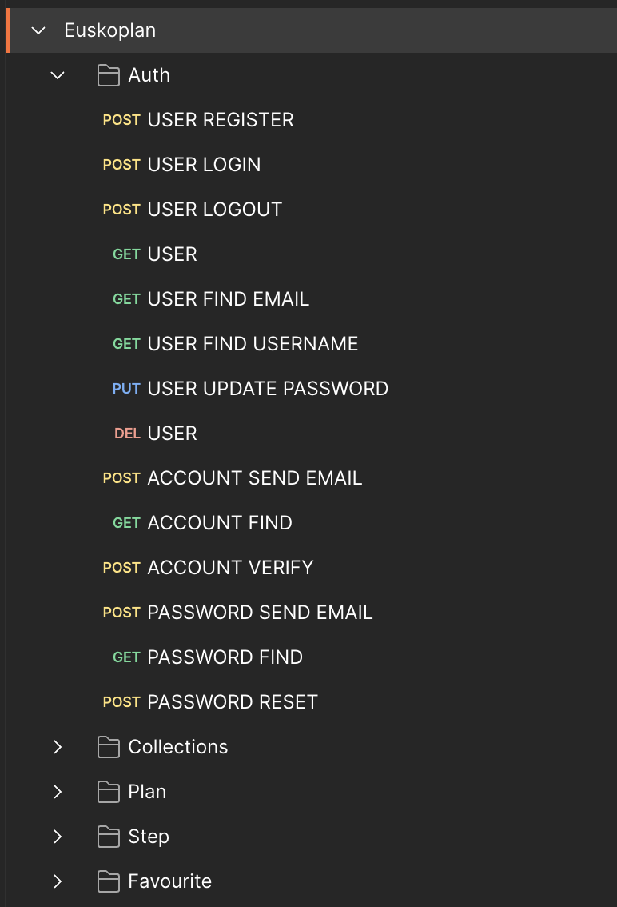

# 🚧 Under Development 🚧

# Euskoplan API

A REST API backend built in Laravel for the [Euskoplan Client](https://github.com/asier-ortiz/euskoplan-client) project.

It allows users to create and manage tourism plans using various catalogs from [Open Data Euskadi](https://opendata.euskadi.eus/inicio/) and generate personalized itineraries.

Users can either manually create their own itineraries or automatically generate them using AI via the OpenAI API.

The information is sourced from XML files, which are parsed and automatically updated in the database every Monday between 00:00 and 06:00 (Europe/Madrid) using a Cron job. Additionally, you can manually trigger a database update if necessary.

The API also integrates with Mapbox for route calculation and manages authentication and authorization with [Laravel Sanctum](https://laravel.com/docs/10.x/sanctum) and [Laravel Gates](https://laravel.com/docs/10.x/authorization#gates).

# Instructions

Before starting, make sure you have Docker installed.

- [Docker](https://www.docker.com/)

## 1. Laravel .env Configuration File

- Navigate to the Laravel project directory

```shell
cd euskoplan-api
```

- Copy `.env.example` to `.env`

On Windows

```shell
copy .env.example .env
```

On macOS / Linux

```shell
cp .env.example .env
```

- Modify the application name in the `.env` file

```text
APP_NAME=Euskoplan
```

- Modify the database credentials in the `.env` file

```text
DB_CONNECTION=mysql
DB_HOST=db
DB_PORT=3306
DB_DATABASE=api
DB_USERNAME=user
DB_PASSWORD=password
```

- Modify Redis settings in the `.env` file

```text
REDIS_HOST=redis
REDIS_PORT=6379
REDIS_PASSWORD=password
```

- Modify the email server settings in the `.env` file

```text
MAIL_MAILER=smtp
MAIL_HOST=mailhog
MAIL_PORT=1025
MAIL_USERNAME=null
MAIL_PASSWORD=null
MAIL_ENCRYPTION=null
MAIL_FROM_ADDRESS=euskoplan@test.com
MAIL_FROM_NAME="${APP_NAME}"
```

- Add Mapbox and OpenAI tokens in the `.env` file

```text
MAP_BOX_TOKEN="<YOUR_KEY>"
OPENAI_API_KEY="<YOUR_KEY>"
```

## 2. Start Docker and Launch the Containers

- From the root directory of the project, run the following command and wait for it to finish:

```shell
docker compose up -d
```

## 3. Vendor Directory and Encryption Key Generation

> :warning: This step is only necessary the first time.

- From the root directory of the project, run the following command and wait for the installation to complete:

```shell
docker compose exec php composer install
```

- If you see a warning about the lock file being out of date, run the following command to synchronize it:

```shell
docker compose exec php composer update
```

> :warning: Running `composer update` will update the lock file to match the composer.json, ensuring dependencies are up to date.

- From the root directory of the project, run the following command:

```shell
docker compose exec php php artisan key:generate
```

## 4. Migrations

- To generate the tables, from the root directory of the project, run:

```bash
docker compose exec php php artisan migrate
```

## 5. Seeders

- To load the data into the database, from the root directory of the project, run:

```bash
docker compose exec php php artisan db:seed
```

## 6. Queue Workers

- **Queues** are used in the application to handle background jobs like sending emails and processing collections. To ensure that emails and other background jobs are processed, you need to run queue workers for each type of job.

### 6.1 Running Queue Workers for Email Jobs

To start processing email-related jobs, run the following command:

```bash
docker compose exec php php artisan queue:work --queue=emails
```

### 6.2 Running Queue Workers for Collection Processing Jobs

To start processing jobs related to updating collections, run the following command:

```bash
docker compose exec php php artisan queue:work --queue=collections
```

> :warning: These workers should be running at all times to process queued jobs for sending emails and updating collections.

## 7. Access the Services

Once the Docker containers are running, you can access various services provided by the application. Below are the details on how to access each service:

- **phpMyAdmin**: A web interface to manage your MySQL database.
    - URL: [http://localhost:8081](http://localhost:8081)
    - Connection Details:
        - **Server**: `db`
        - **Username**: `user`
        - **Password**: `password`

- **RedisInsight**: A web tool for managing and monitoring Redis databases.
    - URL: [http://localhost:5540](http://localhost:5540)
    - Connection Details:
        - **Host**: `redis`
        - **Port**: `6379`
        - **Username**: (leave blank)
        - **Password**: `password`
        - **Database Index**: `1`

- **MailHog**: A web interface to view emails sent by the application (for local development only).
    - URL: [http://localhost:8025](http://localhost:8025)

- **Postman**: Use Postman to test the API endpoints. You can download and import a pre-configured Postman file:
    - Download the file [here](https://drive.google.com/file/d/1KtY4w0z94aVRbSv4h-5wdPcGCgjUzA68/view?usp=sharing) and import it into Postman.

## 8. Shell Access to the Application Container

```shell
docker compose exec php /bin/bash
```

## 9. Stop the Containers

```shell
docker compose stop
```

## 10. Database Updates

#### Automatic Updates
- The database is automatically updated via a scheduled **Cron Job**, which runs every Monday between **00:00 and 06:00 (Europe/Madrid)**. During this time, the system will fetch the latest data from [Open Data Euskadi](https://opendata.euskadi.eus/inicio/) and update the database.

#### Manual Updates
- If you need to manually force an update (for example, during testing or debugging), you can do so by running the following command:

```bash
docker compose exec php php artisan collections:cron
```

> :warning: Depending on the amount of data, the update process can take some time.

## Other

- There is a test user to access the web application with the following credentials:
    - Username: test
    - Email: test@test.com
    - Password: password

## Screenshots


